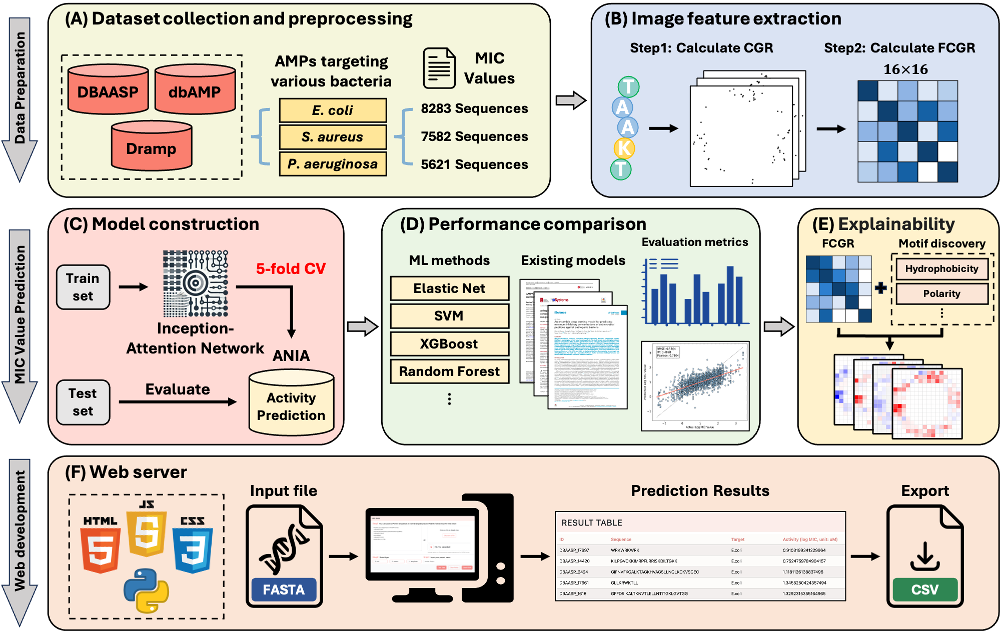
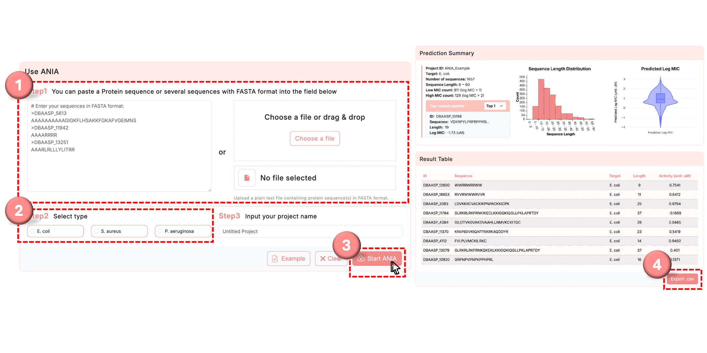

# ANIA: An Inception-Attention Network for Predicting Minimum Inhibitory Concentration of Antimicrobial Peptides

ANIA is a deep learning framework for predicting the minimum inhibitory concentration (MIC) of antimicrobial peptides (AMPs). It integrates Chaos Game Representation (CGR)-based sequence encoding with an Inception-Attention neural network to provide accurate MIC regression across multiple bacterial strains.

## Getting Started

This project provides a modular and command-line-driven pipeline via `main.py`, covering all stages from data collection to deep learning prediction.

### 1. Setup Conda Environments

```bash
# For deep learning (PyTorch + ANIA)
conda env create -f envs/AMP_DL_env.yml

# For CGR encoding (requires R and kaos)
conda env create -f envs/AMP_R_env.yml

# For classical ML and iFeature processing
conda env create -f envs/AMP_data_env.yml
```

### 2. Run the Pipeline via main.py

The pipeline consists of modular stages:

| Stage       | Description |
|-------------|-------------|
| `collect`   | Collect raw AMP sequences and MIC values |
| `clean`     | Clean and aggregate the dataset |
| `group`     | Assign MIC groups (optional) |
| `split`     | Stratified splitting into training/testing |
| `ifeature`  | Extract iFeature features (AAC, PAAC, etc.) |
| `train_ml`  | Train ML models (e.g., SVM, RF, XGBoost) |
| `test_ml`   | Evaluate ML models |
| `cgr`       | Encode sequences using CGR |
| `train_ania`| Train ANIA deep learning model |
| `test_ania` | Test ANIA model and export predictions |

### Example Commands

```bash
# Step 1: Collect and Clean Data
python main.py --stage collect --log_path logs/collect.log
python main.py --stage clean --log_path logs/clean.log

# Step 2: Encode Sequences (CGR or iFeature)
python main.py --stage cgr --log_path logs/cgr.log
python main.py --stage ifeature --log_path logs/ifeature.log

# Step 3: Train and Test ML Models
python main.py --stage train_ml --log_path logs/train_ml.log --model_type ridge xgboost
python main.py --stage test_ml --log_path logs/test_ml.log --model_type ridge xgboost

# Step 4: Train and Test Deep Learning Model (ANIA)
python main.py --stage train_ania --strain "Pseudomonas aeruginosa" --log_path logs/train_ania.log
python main.py --stage test_ania --strain "Pseudomonas aeruginosa" --log_path logs/test_ania.log --model_input_path weights/ANIA_PA.pth --prediction_output_path results/ania_predict.csv
```

## Data and Model Download

To facilitate reproducibility and enable further research, all curated datasets, CGR/iFeature-encoded features, and pretrained deep learning models used in this study are publicly available at the following link:

🔗 [https://biomics.lab.nycu.edu.tw/ANIA/#/download](https://biomics.lab.nycu.edu.tw/ANIA/#/download)

The following resources can be downloaded:

- Cleaned AMP sequences with MIC annotations (CSV and FASTA formats)
- CGR-encoded feature matrices for deep learning models
- iFeature-encoded descriptors for traditional ML models
- Pretrained model weights for *E. coli*, *S. aureus*, and *P. aeruginosa*

### Available Datasets

The dataset comprises antimicrobial peptides (AMPs) tested against three clinically important bacterial species:
**Staphylococcus aureus**, **Escherichia coli**, and **Pseudomonas aeruginosa**.

| Bacteria            | Set   | Format | Description                                 |
|---------------------|--------|--------|---------------------------------------------|
| *E. coli*           | Train  | CSV    | Training data for MIC regression            |
|                     |        | FASTA  | Raw AMP sequences in FASTA format           |
|                     | Test   | CSV    | Testing data for MIC evaluation             |
|                     |        | FASTA  | Testing sequences in FASTA format           |
| *S. aureus*         | Train  | CSV    | Training data for MIC regression            |
|                     |        | FASTA  | Raw AMP sequences in FASTA format           |
|                     | Test   | CSV    | Testing data for MIC evaluation             |
|                     |        | FASTA  | Testing sequences in FASTA format           |
| *P. aeruginosa*     | Train  | CSV    | Training data for MIC regression            |
|                     |        | FASTA  | Raw AMP sequences in FASTA format           |
|                     | Test   | CSV    | Testing data for MIC evaluation             |
|                     |        | FASTA  | Testing sequences in FASTA format           |

All files are directly accessible through the web interface and can be used as input for training/testing the ANIA model or benchmarking traditional ML pipelines.

## Figures and Visualizations

### ANIA Workflow


**Figure 1.** *Workflow of the ANIA-based MIC prediction system.*
(A) Dataset collection and preprocessing. Antimicrobial peptide sequences and corresponding MIC values targeting *E. coli*, *S. aureus*, and *P. aeruginosa* were curated from public databases (DBAASP, dbAMP, DRAMP).
(B) Image feature extraction using CGR and frequency matrix transformation.
(C) Model construction using an Inception-Attention Network with 5-fold cross-validation and evaluation on an independent test set.
(D) Performance comparison with conventional machine learning methods and existing AMP prediction tools.
(E) Feature-level explainability analysis based on FCGR-derived spatial patterns and physicochemical property mapping.
(F) Web server development for user interaction, FASTA input submission, prediction display, and CSV export.

---

### CGR Encoding and ANIA Model Architecture



**Figure 2.** *Overview of CGR encoding and the ANIA model architecture.*
(A) Application of CGR to an example AMP sequence (VLNEALLR), visualizing spatial encoding of sequential residues.
(B) FCGR generation via spatial partitioning of the CGR trajectory, illustrating 3-mer motif localization using a representative AMP sequence.
(C) The overall framework of ANIA, comprising stacked Inception modules, a Transformer encoder, and a regression head for MIC prediction.
(D) Internal configuration of the Inception module, with four parallel branches for extracting multi-scale sequence features.

---

### ANIA Web Platform Interface



**Figure S6.** *Diagram of the ANIA web interface using example AMP sequences.*
